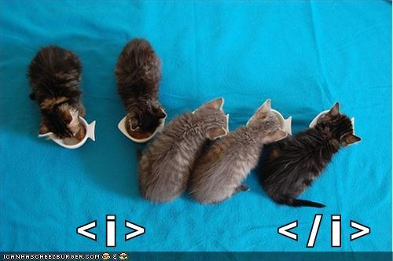

Basis HTML5 & CSS3 (voor CoderDojo)
=====

*Auteur(s): Richard Vollebregt*

Inhoudsopgave
=====

* [Voorwoord](#voorwoord)

## [HTML5](#html5)

<!-- TODO Toevoegen van links naar de juiste headings -->
1. [Basis structuur](#basis-structuur)
* [Teksten](#teksten)
* [Lijsten](#lijsten)
* [Links](#links)
* [Plaatjes](#plaatjes)
* [Tabellen](#tabellen)
* [HTML5 Elementen](#html5)
* Structuur & Semantiek
* Meta informatie
* Referentie
* Formulieren

## [CSS3](#css3)

<!-- TODO Toevoegen van links naar de juiste headings -->
1. [Basis](#css-basis)
* [Classes & ID's](#classes)
* [Kleuren & Achtergronden](#kleuren)
* [Teksten & fonts](#teksten)
* [Margin & padding](#margin)
* [Positionering](#positionering)
* [Basis selectors](#selectors)
* [Basis effecten & animaties](#effecten)

## [Opdrachten](#opdrachten)
<!-- TODO Toevoegen van links naar de juiste headings -->
* [Opdracht 1](#opdracht1): Maak een lijst met links naar je favoriete pagina's   
  * <small>Hoofdstukken 1 t/m 4 van HTML</small>
* [Opdracht 2](#opdracht2): Maak een tabel die de Eredivisie statistieken toont
  * <small>Hoofdstuk 5 & 6 van HTML</small>
* [Opdracht 3](#opdracht3): Voeg kleur toe aan je lijst met links van Opdracht 1
  * <small>Hoofdstuk 1 t/m 3 van CSS</small>
<!-- * Opdracht ?: Maak een menu die openklapt -->

Links met extra informatie
-----
* Wat zijn pixels? https://nl.wikipedia.org/wiki/Pixel
* Hoe werken kleuren? https://nl.wikipedia.org/wiki/RGB-kleursysteem
* Referentie voor HTML elementen: https://nl.wikipedia.org/wiki/Lijst_van_HTML-elementen
* Referentie voor CSS eigenschappen: http://83.96.174.175/referentie/css/

 Voorwoord
======

Welkom bij deze basis tutorial voor het leren van HTML & CSS. Deze tutorial is speciaal geschreven voor gebruik bij CoderDojo's.
Voel je vrij om stukken over te nemen, uit te breiden en/of te verbeteren.

Veel plezier met het leren van HTML & CSS!

 HTML5
======

 Basis structuur
======

### Wat is HTML?
HTML is een afkorting voor __Hypertext Markup Language__. Met deze taal vertel je aan je browser (bijvoorbeeld Chrome, Safari of Internet Explorer) hoe hij een webpagina moet tonen. We gaan in dit hoofdstuk de basis structuur bekijken.

### Een simpele HTML pagina
Een HTML pagina bestaat uit een aantal __tags__. Deze tags zijn de basis voor het bouwen van je pagina. Een tag kan je herkennen aan deze tekens: __<__ en __>__. Sommige HTML elementen hebben maar 1 tag, zoals ``. Andere HTML elementen hebben een openende en een sluitende tag, zoals `<html></html>`, hier plaats je weer andere tags of tekst tussen. De sluitende tag kan je herkennen aan de __/__.

Om een HTML pagina te maken zijn er een aantal tags die noodzakelijk zijn.
Allereerst moeten we aangeven dat het om een HTML pagina gaat. Dit doe je met de `<html></html>` tag. Alle andere tags komen hiertussen te staan. We voegen eerst een `<head></head>` tag toe. Dit element voorziet je pagina van extra informatie, zoals een titel. Onder deze tag zetten we een `<body></body>` tag neer. Dit is het gedeelte waar je je webpagina in bouwt. Hier kun je de meeste andere tags of tekst in plaatsen. Hieronder staat de uitgewerkte HTML:

~~~
<html>
  <head>
    <title>Dit is de titel van je webpagina</title>
  </head>
  <body>
    Dit is de body van je webpagina.
  </body>
</html>
~~~

*Dit is de basis structuur van een webpagina.*

__Korte opdracht:__
Neem deze HTML structuur over in je tekst editor en verander daarna de titel en de tekst van de webpagina. Sla daarna het bestand op als een .html bestand en open deze in je browser. Als je extra uitleg nodig hebt, kun je een van de coaches aanspreken.

 Teksten
======

In dit hoofdstuk bespreken we kort de verschillende elementen die zijn te gebruiken voor het plaatsen van teksten. Hieronder volgt een korte opsomming van de verschillende tags met een voorbeeld en wat je met het element kan doen.

#### Paragraaf
`
Dit is een paragraaf
`

Met het paragraaf element kan je netjes een stuk tekst invoegen. Binnen deze paragraaf kan je ook andere elementen toevoegen om bijvoorbeeld een stukje van de tekst vetgedrukt of cursief te maken.

#### Kopregels
`<h1>Dit is een kopregel</h1>`

Met __heading__ elementen kan je een kopregel toevoegen. Deze worden gebruikt voor het toevoegen van een titel aan je tekst. Deze komen bijvoorbeeld boven een paragraaf te staan. Er zijn 6 verschillende heading elementen, namelijk van `<h1></h1>` t/m `<h6></h6>`. Deze verschillen (standaard) in grootte, waar `<h1>` het grootst is en `<h6>` het kleinst.

#### Vet gedrukt
`<b>Dit is een vetgedrukte zin</b>`  
`<strong>Dit is een belangrijke vetgedrukte zin</strong>`

#### Cursief
`<i>Dit is een cursief gedrukte zin</i>`  
`<em>Dit is een belangrijke cursief gedrukte zin</em>`

Om stukken tekst vetgedrukt of cursief te maken, kun je hier de bovenstaande tags omheen zetten. Er is een verschil tussen de twee soorten. Hier kan je meer over vinden in het hoofdstuk over Semantiek.

__Korte opdracht:__
Zoek op internet een 'Lorem Ipsum' generator (en als je wilt de oorsprong van deze tekst). Voeg 2 paragrafen van deze tekst toe aan je eigen webpagina en maak een aantal stukken <em>cursief</em> en <strong>vetgedrukt</strong>. Zorg er daarna voor dat elke paragraaf erboven een kopregel krijgt in verschillende groottes.

 Lijsten
======

Bij het maken van webpagina's zijn lijsten vaak erg handig. Ze geven je overzicht en structuur. Hieronder vind je een voorbeeld van een lijst in HTML:

~~~
<ul>
  <li>Melk</li>
  <li>Brood</li>
  <li>Kaas</li>
</ul>
~~~

<ul>
  <li>Melk</li>
  <li>Brood</li>
  <li>Kaas</li>
</ul>

Er zijn een aantal verschillende typen lijsten. In dit hoofdstuk bespreken we er twee van. Dit zijn de __unordered list__ `<ul></ul>` en de __ordered list__ `<ol><\ol>`. Zoals je misschien al door hebt, heeft de unordered list geen nummering en de ordered list wel.
Tussen deze lijst elementen worden altijd de __list items__ `<li></li>` geplaatst zoals in het voorbeeld hierboven.

__Korte opdracht:__
Maak een eigen lijst op je webpagina. Je kunt bijvoorbeeld een opsomming maken van al je verschillende spellen of films die je thuis hebt. Zorg dat je favoriete lijst items goed te zien zijn door de tekst bijvoorbeeld vetgedrukt of cursief te maken.

 Links
======

Op je pagina is het natuurlijk leuk als je naar mensen naar andere websites of één van je andere pagina's kan sturen. Dit kunnen we doen met links.
Een link kunnen we maken door het `` element te gebruiken (`<a>` is een afkorting voor anchor).

Om een link te maken kunnen we een stuk tekst omringen met deze tags. Alleen moeten we ook aan deze tag kunnen vertellen waar de link naar toe moet verwijzen. Om dat voor elkaar te krijgen kunnen we een eigenschap toevoegen aan de openende tag. Dit heet een __attribute__. Voor deze tag gaan we het __href__ attribuut gebruiken. Dat ziet er zo uit:

`<a href="http://www.google.com">Dit is een link naar Google</a>`

We gebruiken de volgende manier om een attribuut toe te voegen:

`href="http://jouwwebsitehier.nl"`

Deze manier geldt voor het toevoegen van alle beschikbare attributen. Vaak hebben HTML elementen meerdere attributen die je kan gebruiken. Welke eigenschappen je kan gebruiken is afhankelijk van het HTML element. De attributen staan altijd in de openings-tag. Het is ook mogelijk om meerdere attributen toe te voegen per tag.

__Korte opdracht:__
Voeg in je tekst een link toe naar een website die je vaak bezoekt. Zoek ook op internet op waar de __target__ attribuut voor is bij de `<a>` tag en voeg deze op de juiste manier toe aan je link.

 Plaatjes
======
Een website is natuurlijk niet interessant zonder plaatjes. Met HTML kunnen we heel gemakkelijk onze eigen afbeeldingen toevoegen met de `` tag.
Dit is een HTML element die maar één tag gebruikt. Om een plaatje toe te voegen moeten we het `src` attribuut gebruiken ('source', vertaald naar het Nederlands is dat 'bron'). Hieronder zie je een voorbeeld:

``

Het pad van de afbeelding wordt altijd gezien vanuit de map waar je HTML bestand staat. Dat betekent dat als je plaatje in de map __images__ staat, dat je als pad `images/afbeelding1.jpg` gebruikt om deze te laden.

Browsers ondersteunen een aantal verschillende soorten bestandsformaten. De meest voorkomende bestandsformaten zijn __.png__, __.jpg__ en __.gif__.

__Korte opdracht:__
Zoek een leuk plaatje van het internet en download deze naar je eigen computer. Vervolgens plaats je het plaatje bij je HTML bestand in een nieuwe folder (gebruikelijk is om de folder __images__ te noemen). Voeg nu een nieuwe `` tag toe in je HTML bestand. Probeer ook uit te vinden welk attribuut je kan gebruiken om je plaatje een titel te geven.

 Tabellen
======

Tabellen zijn een goede oplossing als je veel informatie op je website wil zetten.
Een tabel maak je met het HTML element `<table>`. Hieronder zie je een voorbeeld:

~~~
  <table>
  <tr>
    <td><b>Datum</b></td>
    <td><b>Tijd</b></td>
    <td><b>Locatie</b></td>
    <td><b>Wat</b></td>
  </tr>
  <tr>
    <td>28-05-2016</td>
    <td>11:00</td>
    <td>Bibliotheek Tiel</td>
    <td>HTML/CSS</td>
  </tr>
  <tr>
    <td>25-06-2016</td>
    <td>11:00</td>
    <td>Bibliotheek Tiel</td>
    <td>HTML/CSS</td>
  </tr>
  </table>
~~~

<table>
<tr>
  <td><b>Datum</b></td>
  <td><b>Tijd</b></td>
  <td><b>Locatie</b></td>
  <td><b>Wat</b></td>
</tr>
<tr>
  <td>28-05-2016</td>
  <td>11:00</td>
  <td>Bibliotheek Tiel</td>
  <td>HTML/CSS</td>
</tr>
<tr>
  <td style="border: 2px solid red" colspan="2">25-06-2016 om 11:00</td>
  <td>Bibliotheek Tiel</td>
  <td>HTML/CSS</td>
</tr>
</table>

Een tabel bestaat uit rijen en kolommen. In HTML maak je eerst een rij met een `<tr>` element, daarna voeg je daartussen je tabel cellen toe met de `<td>` elementen. Dit worden je kolommen. Zorg ervoor dat je evenveel tabel cellen hebt per rij.

__Korte opdracht:__
Maak een kleine tabel in je HTML bestand. Als je dit hebt gedaan kan je opzoeken hoe je een tabel cel over 2 cellen kan laten lopen zoals het voorbeeld hierboven.

 HTML5 Elementen
=====
Sinds de komst van HTML versie 5 (HTML5) zijn er een aantal nieuwe tags toegevoegd die we kunnen gebruiken. Deze nieuwe elementen bieden tags om een betere semantiek te bieden voor je webpagina. Semantiek en waarom het belangrijk is bespreken we verder in het Semantiek hoofdstuk.

Een lijstje met alle nieuwe HTML5 elementen kan je hier vinden:
http://www.w3schools.com/html/html5_new_elements.asp

Hieronder volgt een korte uitleg van de meest gebruikte nieuwe HTML5 tags.
~~~
<header></header>
~~~
Met de __header__ tag kunnen we aangeven dat het gaat om de kop van je website of van een article in je website (dit is een ander nieuw HTML5 element). Hier kan je bijvoorbeeld een logo inzetten en je navigatie menu.

~~~
<footer></footer>
~~~
De __footer__ tag wordt vaak gezien als het tegenovergestelde van de __header__ tag. Deze komt namelijk altijd onderin je pagina of aan het einde van een article. Deze gebruik je vaak om de pagina te voorzien van wat extra informatie. Vaak staan onderin adresgegevens en extra links.

~~~
<article></article>
~~~
Met een __article__ element geef je aan dat het om een los staand onderdeel op je site gaat. Bijvoorbeeld een artikel, blog post of een gebruiker comment.

~~~
<section></section>
~~~
Een __section__ tag markeert een deel van een groter onderdeel. Zo kun je deze onder een `<article></article>` element hangen.

~~~
<main></main>
~~~
Met dit element kunnen we aangeven dat het om de belangrijkste content gaat op onze website. Deze tag kunnen we mooi combineren met `<header></header>` en `<footer></footer>`.

~~~
<aside></aside>
~~~
Met __aside__ kunnen we aangeven dat het om een 'sidebar' gaat binnen de site of een article

~~~
<nav></nav>
~~~
Dit element spreekt eigenlijk voor zich, we kunnen hiermee een navigatie structuur aangeven (deze tag wordt dan ook alleen voor een lijst van links en niet voor losse links binnen de pagina).

~~~
<address></address>
~~~
Ook deze tag spreekt voor zich, we kunnen hiertussen een adres weergeven.

Om extra te weten te komen over deze belangrijkste nieuwe HTML5 tags kun je deze link bekijken (in het Engels!):
http://blog.teamtreehouse.com/use-html5-sectioning-elements

 CSS
=====

 Basis
=====

CSS (Cascading Style Sheets) wordt gebruikt om de weergave van je HTML en webpagina aan te passen. Je kunt bijvoorbeeld de grootte van je tekst aanpassen, achtergrondkleuren instellen en HTML elementen verplaatsen. In de volgende hoofdstukken gaan we zoveel mogelijk in op de basis van het toevoegen van CSS aan je webpagina en aantal verschillende CSS eigenschappen.

Eerst gaan we een nieuw CSS bestand aanmaken in dezelfde map als je HTML bestand. Deze kunnen we bijvoorbeeld __style.css__ noemen. We gaan deze daarna in je HTML bestand invoegen. Dit gebeurt met een `<link>` tag die je in de `<header>` zet. Het CSS bestand wordt dan op de pagina ingeladen. Het voordeel van deze manier van toevoegen van CSS is dat je niet voor elke pagina weer dezelfde CSS hoeft toe te voegen.

`<link rel="stylesheet" href="style.css" >`

We voegen hier twee verschillende attributen toe, namelijk het `rel` attribuut en `href`. De `rel` eigenschap moet aanwezig zijn op de tag, hier geef je mee aan dat het om een Style Sheet gaat. Met `href` geef je aan waar het bestand staat.

__Korte opdracht:__
Zorg ervoor dat je een nieuw CSS bestand aanmaakt in de map met je HTML bestand. Zet daarna correct de `<link>` tag tussen je `<head>` tags.

 Classes & ID's
=====

Om goed gebruik te kunnen maken van CSS moeten we weten wat classes & ID's zijn.
Classes en ID's kunnen we aan HTML elementen koppelen met een attribuut. Dit gebeurt met de eigenschappen `class` en `id`. Het verschil tussen deze twee attributen is dat een class meerdere keren mag voorkomen op een pagina en een ID maar één keer voorkomt op een pagina.

We kunnen in ons CSS bestand een class toevoegen als volgt:

`.rood`

We gebruiken een punt voor de classnaam om aan te geven dat het om een class gaat. Een classnaam kan je altijd zelf bepalen. Vervolgens kunnen we aan deze class eigenschappen toekennen. Om dat te doen moeten we deze CSS eigenschappen tussen __{__ en __}__ tekens plaatsen, dat ziet er zo uit:

~~~
/* Dit is een class */
.rood {
  color: red;
}

/* Dit is een ID */
#geel {
  color: yellow;
}
~~~

Eerst kies je de eigenschap die je wil gebruiken. Na de naam van de eigenschap dat je wil gebruiken zet je een __:__ en volgt daarna de waarde die je wil gebruiken. Uiteindelijk sluit je de regel af met een __;__. In dit voorbeeld hierboven veranderen we de kleur van tekst naar rood van elk HTML element dat de class __rood__ heeft. Die voegen we met een attribuut toe aan een HTML tag net zoals hieronder.

`<strong class="rood">Dit is rode vetgedrukte tekst</strong>`

Voor ID's kunnen we hetzelfde doen als voor een class. Alleen gebruiken we in plaats van een __.__ een __#__.

`<strong id="geel">Dit is een gele vetgedrukte tekst</strong>`

__Korte opdracht:__
Zoek op internet wat de verschillen zijn tussen classes en ID's en welke je beter kan gebruiken.

 Kleuren & Achtergronden
=====

Nu we hebben geleerd hoe je classes en ID's kan gebruiken, kunnen we de echte eigenschappen van CSS bekijken en toevoegen.
We maken eerst een nieuwe class aan in het CSS bestand.

~~~
.blauw {}
~~~

Om de kleur van tekst te kunnen aanpassen, gebruiken we de eigenschap `color`. Ook kunnen we de kleur van de achtergrond aanpassen. Hier gebruiken we `background-color` voor.

~~~
.blauw {
  color: white;
  background-color: blue;
}
/* Let op: we sluiten een CSS regel altijd af met een ; */
~~~

Met deze CSS class kunnen we nu de achtergrond blauw maken en de kleur van de tekst wit. Deze class kan je aan een element van je HTML pagina toevoegen.

`<h1 class="blauw">Dit is een Header met een blauwe achtergrond</h1>`

__Korte opdracht:__
Voeg een class toe aan je CSS bestand. Gebruik je gemaakte class op een HTML element naar keuze. Als je het goed hebt gedaan krijg je nu een blauw blok met witte tekst te zien.

Let op: Als je CSS niet werkt, controleer dan of je CSS bestand in je `<head>` is ingevoegd en of je CSS regels met een __;__ zijn afgesloten.

Zoek op internet op welke andere kleuren je kan gebruiken in je CSS. Er zijn meerdere kleuren beschikbaar die je met hun naam kan toevoegen, zoals `red, black, grey` etc. Maar we kunnen ook zelf een kleur maken met het RGB-kleursysteem. Je kan [hier](https://nl.wikipedia.org/wiki/RGB-kleursysteem) meer info vinden er over.

 Teksten & fonts
=====

Een website bestaat vaak voor een groot gedeelte uit tekst. Je wil op je website meestal informatie overbrengen aan anderen en daar is tekst natuurlijk erg geschikt voor. Met CSS kunnen we deze teksten op allerlei manieren aanpassen.
Één van de simpelste CSS regels zijn we al tegengekomen, namelijk `color`.

Natuurlijk zijn er nog veel meer verschillende aanpassingen mogelijk. Later bespreken we een aantal van deze eigenschappen.

Allereerst is het belangrijk dat we gebruik kunnen maken van andere lettertypes. We zullen hiervoor gebruik gaan maken van Google Fonts, omdat deze gemakkelijk te gebruiken zijn en er erg veel keus is.

Open in je browser de URL http://www.google.com/fonts. Hier kies je een mooi lettertype uit en klik je op __Add to Collection__. Dit lettertype wordt dan toegevoegd. Nu kunnen we onderin op de knop __Use__ klikken.
Als je dat hebt gedaan, krijg je een `<link>` tag te zien, die je kan toevoegen aan je website. Deze moet je tussen je `<head>` tags zetten. Deze link tag zorgt er voor dat je browser weet waar hij het lettertype moet downloaden. Als je dat hebt gedaan, kunnen we in ons CSS bestand de `font-family` code toevoegen aan het body element.

~~~
  body {
    font-family: 'Open Sans', sans-serif;
  }
~~~

Als je dan de pagina herlaadt nadat je de HTML en CSS bestanden hebt opgeslagen, zie je dat je lettertype is ingeladen!
We kunnen de teksten ook je pagina ook aanpassen op andere manier. We hebben al eerder met HTML gewerkt om teksten *cursief* of bijvoorbeeld **vetgedrukt** te maken. Natuurlijk kunnen we dit ook met CSS regelen, en dat is dan ook de beste manier van werken. We willen dat CSS al het uiterlijk verzorgt en dat HTML alleen de structuur en semantiek voor zijn rekening neemt.

Hieronder volgt een lijstje van eigenschappen waarmee je je tekst kan aanpassen:

* Lettertype grootte
  * Met `font-size` kun je de grootte van je tekst aanpassen. Dit doen we voor nu in pixels.
  ~~~
  p {
      font-size: 18px;
  }
  ~~~
* Lettertype stijl
  * We kunnen `font-style` gebruiken om tekst cursief te maken.
  ~~~
  h2 {
      font-style: italic;
  }
  ~~~
* Lettertype gewicht
  * Om een tekst vetgedrukt te maken, gebruiken we `font-weight`.
  ~~~
  span {
      font-weight: bold;
  }
  ~~~

* Tekstkleur
  * Voor de kleur gebruiken we het `color` eigenschap.
  ~~~
  h3 {
      color: #FFFF00;
  }
  ~~~

* Tekst uitlijning
  * Tekst kunnen we bijvoorbeeld links, rechts of in het midden uitlijnen ten opzichte van het element waar het in staat. Hier kunnen we `text-align` voor gebruiken.
  ~~~
  div {
      text-align: right;
  }
  ~~~

* Tekst transformeren
  * We kunnen van tekst ook veranderen of deze bijvoorbeeld in hoofdletters of kleine letters wordt weergegeven
  ~~~
  section {
      text-transform: uppercase;
  }
  ~~~

  Verder zijn er nog meer eigenschappen, alleen worden deze een stuk minder gebruikt dan de eigenschappen die we hierboven hebben genoemd. Je kan ze zelf opzoeken op http://www.w3schools.com/css/css_font.asp en op http://www.w3schools.com/css/css_text.asp

  __Korte opdracht:__
  Maak een nieuwe HTML pagina aan en voeg daar wat tekst aan toe (bijvoorbeeld een stukje tekst over je favoriete film). Zorg ervoor dat je deze opdeelt in paragrafen en kopregels (gebruik verschillende tags hiervoor, zoals `h1` en `h2`). Geef je kopregels verschillende groottes die anders zijn dan de standaard groottes. Zorg er voor dat je kopregels ook een ander lettertype krijgen dan de paragrafen. Je kan weer op Google Fonts een mooi lettertype uitzoeken hiervoor.

 Margin & Padding
=====

HTML elementen kunnen we voorzien van marges en van padding. Marge is de afstand die een element moet hebben ten opzichte van een ander element. Padding is de afstand aan de binnenkant van een element tot de tekst of een ander element.

Onderstaand plaatje geeft een goed beeld van hoe margin en padding werkt op een element (het rode blok):

 Positionering en display
=====
Positionering van HTML elementen is één van de lastigere onderwerpen van CSS. Er zijn vaak meerdere oplossingen om een bepaald resultaat te halen. We beginnen met het uitleggen van de `display` en `position` eigenschappen in CSS.

### Display

Met het `display` eigenschap geef je aan wat voor type jouw HTML element is. Zo wordt voor bijvoorbeeld tekst standaard het `display: inline;` gebruikt. Dit zorgt er voor dat tekst altijd naast elkaar wordt getoond. Ook een `` element heeft standaard `display: inline;` als eigenschap. Inline toont elementen naast elkaar, tot de beschikbare ruimte in een element op is (bijvoorbeeld het einde van je browserscherm) en gaat dan op de volgende regel verder.

Voorbeeld:
~~~
Deze tekst staat 
naast elkaar
~~~

Deze tekst staat 
naast elkaar

Er zijn op `inline` nog een aantal varianten zoals `inline-block`. Deze eigenschap kunnen we gebruiken als we 'block' elementen naast elkaar willen zetten.

Let op dat als je elementen naast elkaar wil zetten, dat alle elementen `display: inline` of `display: inline-block` als eigenschap hebben!

Zoals hierboven genoemd hebben we ook `block` elementen. Dit zijn bijvoorbeeld `
` en `
` tags. Deze elementen gedragen zich als blokken. We kunnen hier een breedte en hoogte aan meegeven en ook margin en padding. Deze blokken komen standaard onder elkaar te staan. We kunnen een `block` element wel naast elkaar weergeven door er een `inline-block` van te maken, zoals we hierboven hebben besproken.

Verder hebben we nog een `display: none;` eigenschap, deze zorgt er voor dat we het element niet meer kunnen zien. Het lijkt misschien niet handig deze CSS regel, maar we zullen deze nog vaak terug zien komen!

Hier kun je kijken hoe een element zich gedraagt met de verschillende soorten display eigenschappen:
http://www.w3schools.com/cssref/playit.asp?filename=playcss_display&preval=inline

### Positie

Een element kunnen we ook verplaatsen met het `position` eigenschap. Er zijn vier verschillende typen `position` die we kunnen gebruiken:

* static (standaard op elk element)
* relative
* fixed
* absolute

Nadat we 1 van deze eigenschappen hebben gekozen (behalve static), kunnen we met `top, bottom, left, right` de positie bepalen.

Het `position: static;` komt standaard voor op elementen, helaas kunnen we met deze vorm `top, bottom, left, right` niet gebruiken en moeten we dus een van de andere vormen gebruiken willen we een verplaatsing doen.

#### Relative

__Relative__ zegt het eigenlijk al: het element staat relatief ten opzichte van andere elementen. Als een `
` tag onder een andere `<h1>` tag staat in de HTML, zie je dit ook zo op het scherm. Het verschil met `position: static;` is dat we dit element kunnen verplaatsen. We kunnen bijvoorbeeld door `top: 10px;` het item 10 pixels __naar beneden__ verplaatsen. Het verplaatsen werkt namelijk als een soort marge. We kunnen ook negatieve waarden gebruiken als we een element de andere kant op willen verplaatsen.

Zo gebruiken we `right: -10px` om een element 10 pixels naar rechts te verschuiven van zijn huidige positie.

~~~
#relatief {
    position: relative;
    top: -30px;
    right: 20px;
}
~~~

#### Absolute

Met `position: absolute;` kunnen we het element absoluut positioneren ten opzichte van een ander element. We moeten wel een belangrijke regel onthouden:

* Een absoluut gepositioneerd element valt altijd binnen de grenzen van een bovenstaand element die de eigenschap `position: relative;` heeft. Als er geen zijn, dan is dit de gehele pagina.

Als we voor een absoluut gepositioneerd element `top: 50px;` instellen, zal deze dus op 50 pixels afstand van de bovenkant van het voorgaande element staan. Een voorbeeld:

Hier hebben we `top: 50px;` en `left: 20px;` toegepast op een absoluut gepositioneerd element. Andere voorbeelden zijn hier te vinden: http://www.w3schools.com/css/css_positioning.asp

#### Fixed

Als laatst hebben we nog het `position: fixed;` eigenschap. Deze werkt op de meeste punten gelijk aan `position: absolute;`. Alleen wordt bij fixed altijd je browser scherm gebruikt als uitgangspunt. Als je dus bij een fixed element `bottom: 0;` instelt, zal deze altijd onderaan in beeld blijven staan.

__Korte opdracht:__ Maak een menu met links zoals we in een van de vorige opdrachten hebben gedaan. Deze willen we nu altijd zichtbaar in beeld hebben. Nadat je het menu hebt aangepast, maak je twee kolommen met `
` elementen. In de kolommen kun je tekst en plaatjes toevoegen. Zorg ervoor dat ze netjes naast elkaar staan.
__Extra:__ Maak de 2 kolommen kleiner en zet deze in het midden van je pagina. (hint: gebruik een 'wrapper' en margin om dit op te lossen). Als je er niet uit komt kan je nog op Google rondzoeken of even om hulp vragen.

 Basis selectors
=====

Er zijn heel veel verschillende mogelijkheden om HTML elementen te kunnen selecteren met CSS selectors. We bespreken de meest voorkomende en meest handige selectors hieronder.

We hebben natuurlijk al eerder kennis gemaakt met classes en id's en het gebruik van de HTML tagnaam zelf zoals `p`. Classes worden met een `.` (punt) aangeduid en id's met een `#` (hekje). De namen van deze classes of id's mag je zelf bepalen. Deze zet je vervolgens op je HTML tag.
Classes mag je meerdere keren gebruiken, id's mag je maar 1x per HTML pagina gebruiken.

We kunnen een CSS selector op heel veel verschillende manieren opbouwen met deze 3 basisblokken.
Om de mogelijkheden begrijpelijk te maken, hebben we een aantal voorbeelden met daarbij een korte uitleg:

~~~
.rood
~~~
Hiermee selecteren we alle HTML tags die class `rood` hebben.

~~~
.rood.vetgedrukt
~~~
Als we nog een class hier achter zetten, selecteren we alleen de HTML tags die de class __rood__ EN __geel__ hebben.

`
Rood vet gedrukt
`

~~~
.rood .vetgedrukt
~~~
Als we een class er achter zetten met ook een spatie tussen de classes, zorgt dat er voor dat alle HTML tags met de class `.vetgedrukt` worden aangesproken die ook een HTML tag bovenstaand hebben met als class `.rood`. Een voorbeeld:

~~~

Dit is een rode <b class="vetgedrukt">tekst</b>

~~~

Deze voorbeelden kunnen we natuurlijk ook meerdere keren toepassen. Je mag zoveel classes achter elkaar zetten als je wil. Ook kun je in plaats van classes id's of elementen gebruiken.
Zo kunnen we met `p.rood` alle paragrafen aanspreken die de class `.rood` hebben

We kunnen ook meerdere losse elementen of classes tegelijk voorzien van CSS regels. Dit kunnen we doen door de elementen, classes of id's met een komma te scheiden van elkaar.

~~~
div, span, p
~~~

Natuurlijk zijn er nog een heel aantal andere selectors te gebruiken. Deze zullen we in een ander hoofdstuk behandelen waar we verder op selectors in gaan.

Voor een uitgebreider overzicht kan je op deze link kijken:
http://www.w3schools.com/cssref/css_selectors.asp

__Korte opdracht:__ Bekijk en omschrijf wat de verschillen zijn tussen `div p`, `div > p` en `div + p`. Een uitleg van de selectors kan je op de CSS selectors link bekijken of aan een van de mentors vragen.

 Basis effecten & animaties
=====

 Opdrachten
=====

 Opdracht 1:
=====
Maak een lijst met links naar je favoriete pagina's
------

Voor de eerste opdracht maken we een nieuw HTML bestand aan. Maak hiervoor een nieuwe map aan.

Zorg ervoor dat je de hoofdstukken 1 t/m 4 hebt gelezen van het HTML onderdeel. Deze hoofdstukken geven uitleg over hoe je de elementen moet gebruiken.
Hieronder staat een stappenplan die je kan volgen om de opdracht te maken.

- Bouw eerst je basis HTML structuur op.
- Voeg dan een titel toe aan je pagina. Kies een goede omschrijving voor wat er op de pagina komt te staan.
- Voeg een kopregel toe en een korte paragraaf die omschrijft waar je lijstje over gaat.
- Maak een nieuw lijstje aan onder de paragraaf. Kies bijvoorbeeld een aantal leuke websites uit.
- De leukste items in je lijst geef je een vetgedrukte tekst.
- Maak nu alle lijst items klikbaar in je pagina en geef er een aantal een target.
- Als je klaar bent kijk je of je links werken. Wat valt je op als je een link heb bezocht en je opent opnieuw je webpagina?

 Opdracht 2:
=====
Maak een tabel die de Eredivisie statistieken toont
-----

Voor deze opdracht gaan we gebruik maken van tabellen en plaatjes (Hoofdstuk 5 & 6 van HTML). Je kan een nieuw HTML bestand aanmaken of doorgaan op het bestand dat je in [Opdracht 1](#opdracht1) hebt gemaakt.

Ga naar de site http://www.eredivisie.nl en bekijk de huidige stand. Deze kan je (voor een deel) overnemen voor je eigen tabel (of je verzint zelf wat voor in je eigen tabel). Hieronder staat een stappenplan die kan gebruiken voor het maken van je tabel:

- Bedenk hoe de structuur wordt van je tabel. Hoeveel rijen en kolommen heb je nodig?
- Voeg de structuur toe in je HTML, je kan gebruik maken van kopieëren en plakken om het wat te versnellen.
- Vul daarna je tabel cellen met alle informatie (je kan ook de plaatjes van de clubs downloaden en toevoegen bijvoorbeeld).
- Zet om de plaatjes een link heen naar de site van de voetbalclub.

 Opdracht 3
=====

Gebruik voor deze opdracht het resultaat van Opdracht 1. Deze kunnen we nu verder uitbreiden met kleuren.

- Maak een class aan voor de achtergrondkleur en tekstkleur van je body. Voeg deze daarna toe in je HTML.
- De kleur van je links veranderen niet, deze hebben al een andere kleur door je browser gekregen. Maak een aparte class aan die je op je links kan gebruiken en verander de tekst- en achtergrondkleur.
- Geef ook je __unordered list__ een ander kleurtje, je zult zien dat de bolletjes voor de links van kleur veranderen.
- Extra: kan je ook alle links in één keer veranderen van kleur zonder elke link een class te geven? Hoe kan je dit voor elkaar krijgen?

 Menu Opdracht
=====

Om alles wat we tot nu toe geleerd hebben uit te proberen, maken we een dropdown menu die automatisch openklapt als je met je muis over een item heen gaat die sub-items heeft.

De plaatjes hieronder zijn een voorbeeld van een menu dat je kan maken:

Om een goed menu te kunnen maken, moet je goed bedenken hoe de HTML structuur moet worden.
We kunnen voor de navigatie het `<nav></nav>` element gebruiken. Dit element is speciaal voor navigatie menu's. Binnen dit element maken we een lijst met menu items, zoals we al eerder hebben gedaan. Maar om een extra menu te maken onder één van de items, moeten we nog een lijst maken. Dat ziet er ongeveer zo uit:

~~~
<nav>
  <ul>
    <li>
      <a href="http://www.mijnwebsite.com">Mijn website</a>
      <ul>
        <li><a href="http://www.mijnwebsite.com/fotos">Mijn foto's</a></li>
      </ul>
    </li>
  </ul>
</nav>
~~~

We hebben nu een lijstje gemaakt binnen een lijst item `<li>` (en onder de `` tag). Deze lijst is normaal natuurlijk gewoon zichtbaar. Zorg ervoor dat alle submenu's die onder een lijstitem vallen onzichtbaar zijn. Hier kan je voor zorgen door `display: none` te gebruiken.

Het enige wat we nu moeten doen is er voor zorgen dat als we over een lijstitem gaan met onze muiscursor dat het menu dat we net verborgen hebben weer zichtbaar wordt.
__Hint:__ gebruik hiervoor de parent selector.

Om het menu mooier te maken kan je de hoofdmenu items naast elkaar zetten met bijvoorbeeld `display: inline-block`. Let er wel op dat je onderliggende menu items nu waarschijnlijk ook naast elkaar staan. Dit willen we niet, en moeten we dus ongedaan maken. Met de juiste CSS selector combinatie kunnen we dit makkelijk oplossen. Bekijk goed de structuur om te bepalen hoe je deze CSS regel moet opstellen.
