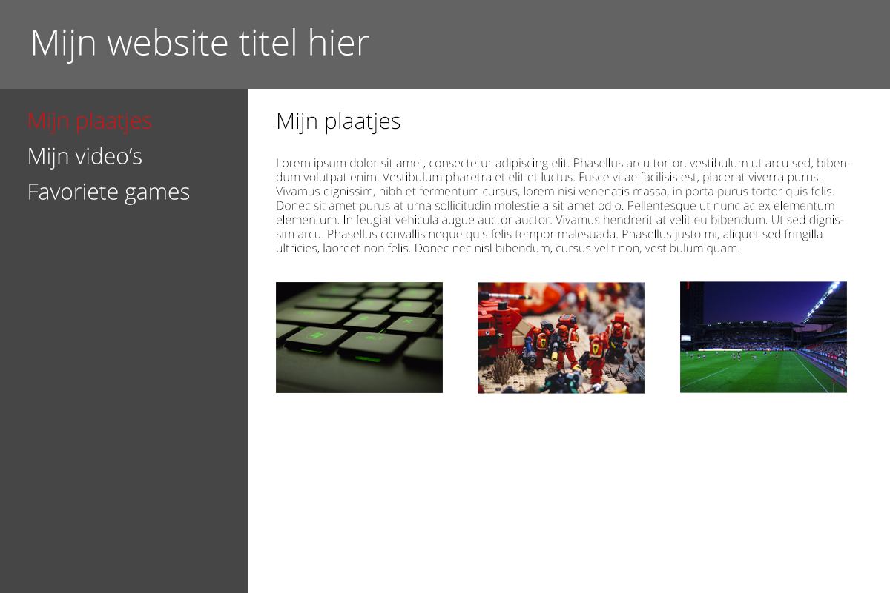

# Website Layouts

## Layout 1

Een website kunnen we op veel manieren opbouwen. Als we geen structuur voor de site maken, wordt alles onder elkaar gezet en dat is natuurlijk saai.

We gaan proberen een simpele website structuur op te bouwen. Hieronder zie je hoe het uiteindelijk er ongeveer uit moet gaan zien:

We hebben bovenin een simpele header met je website titel. Hier mag je ook een logo neerzetten als je dat leuk vindt.

Daaronder hebben we een gedeelte voor de links naar de pagina's van je website en een gedeelte voor je teksten en plaatjes. Als je op één van de links klikt, is het de bedoeling dat degene die de site bekijkt andere tekst en plaatjes krijgt te zien in het witte vlak.

Begin met het opbouwen van je HTML structuur. Zorg ervoor dat je alle basis-onderdelen hebt toegevoegd. Hieronder staat een voorbeeld:

~~~
<!DOCTYPE html>
<html>
  <head>
    <link rel="stylesheet" href="style.css">
    <meta charset="utf-8">
    <title>Mijn website</title>
  </head>
  <body>
  </body>
</html>
~~~

Voeg altijd alles van je website tussen je `body` tags toe. Begin met het toevoegen van een `header` tag. Deze gebruik je voor het bovenste gedeelte van je website. Hier komt je titel of logo in te staan.

Je kunt nu in je CSS een achtergrondkleur toevoegen aan je `header` en de kleur van je tekst. Als je ook een ander lettertype wil gebruiken kan je deze toevoegen aan de `body` tag in je CSS. Hoe je een ander lettertype toevoegt, kan je vinden in het hoofdstuk `Teksten en fonts`.

Als je header af is, komt het moeilijkste gedeelte van de opdracht. Nu moeten we 2 vlakken naast elkaar tonen. Bedenk een manier om dit op te lossen. Je kan meer informatie halen uit het hoofdstuk `Positionering en display`. Er zijn een paar verschillende manieren om dit probleem op te lossen in je CSS. Kom je er niet uit, dan kun je één van de mentors aanspreken. Hieronder is een klein voorbeeld om je op weg te helpen:

~~~
<header>
  <h1>Dit is de titel van mijn website</h1>
</header>

  Mijn links komen in dit vlak

 Mijn tekst en plaatjes komen in dit vlak

~~~

Als het is gelukt om de 2 vlakken naast elkaar te krijgen, kan je de links een leuk effect geven, voor als je met je muis er over heen gaat. Dit kan je vinden onder het `Basis effecten` hoofdstuk.

Wanneer je eerste pagina helemaal af is, kan je deze kopieëren om een nieuwe pagina te maken. Deze kan je dan andere tekst en plaatjes geven. Zorg ervoor dat de links op je pagina's allemaal naar de juiste pagina's toe wijzen. Zo heb je een simpele website en kan je er doorheen klikken.

Laat je resultaat aan de mentors zien. Zij kunnen je tips geven over hoe je site te verbeteren of uit te breiden.
