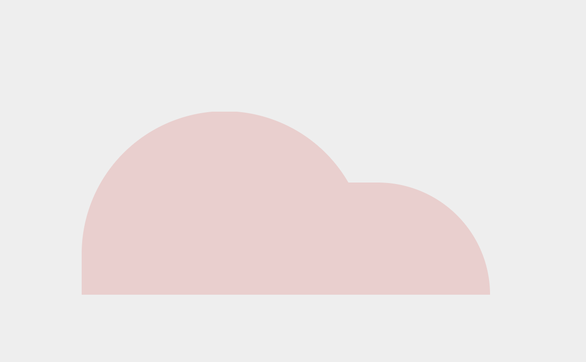

# CSS en HTML Windmolen (met animatie)

We gaan voor deze opdracht een windmolen maken met alleen HTML en CSS3. Hieronder zie je hoe het er uiteindelijk uit moet gaan zien.


Begin met het maken van je HTML pagina en de daarbij behorende standaard HTML structuur die je in de vorige lessen hebt geleerd. Maak ook een nieuw CSS bestand aan en voeg deze toe aan je HTML pagina.

Zet voor nu de kleur van je body naar een simple grijskleur, zodat we ook wit kunnen gebruiken in onze windmolen.

```
body {
  color: #eee;
}
```

Maak in je HTML bestand een nieuwe `<div>` tag en geef deze de class `windmolen`. Deze gaan we gebruiken om onze windmolen in te bouwen.

### Achtergrond

We beginnen eerst met het opbouwen van de achtergrond van het plaatje. Zie hieronder voor een voorbeeld:



Zoals je kunt zien is de achtergrond opgedeeld in 2 bijna halve cirkels. Probeer voor jezelf eerst de grote cirkel goed te krijgen, en daarna pas de tweede cirkel toe te voegen.
Je kan gebruik maken van `border-radius` om een cirkel te maken. De achtergrondkleur die wordt gebruikt voor de heuvels is `#edadac`.

Als je wil kan je voor het maken van deze heuvels `:before` en `:after` gebruiken om alles in 1 HTML tag te maken. Je mag voor de heuvels natuurlijk ook meerdere tags gebruiken en deze los positioneren.

```
Tip: gebruik in dit geval <div></div> tags,
zodat je een vaste hoogte en breedte kan opgeven.
```

### Struiken

Nu dat je de achtergrond klaar hebt, gaan we verder met de struiken in het plaatje. Zie hieronder voor een voorbeeld:


Deze struiken zijn eigenlijk bijna hetzelfde als je achtergrond, alleen dan wat kleiner. Gebruik voor het afronden weer de `border-radius` eigenschap.

Je kan voor de struiken bijvoorbeeld een `<ul>` gebruiken, met daarin het aantal dat je wilt als `<li>` tags. De kleur die wordt gebruikt voor de struiken is `#df615c`

Voor het positioneren kan je per `<ul>` een positie opgeven door middel van een eigen class.

### Basis van de molen

We gaan nu verder met de basis van de molen. Zie hieronder voor een voorbeeld:


De basis bestaat uit drie onderdelen. De algemene structuur, een deur en een raam. Je zou voor dit gedeelte één HTML tag kunnen gebruiken (met weer `:before` en `:after`) of drie verschillende.
Als je er drie gebruikt, probeer deze dan ook nog te groeperen in één tag.

Voor het raam en de deur wordt de volgende kleur gebruikt: `#41155a`. Voor het schaduw effect in de deur en het raam wordt dezelfde kleur gebruikt als de heuvels in de achtergrond.
